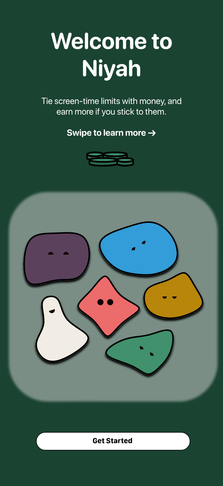
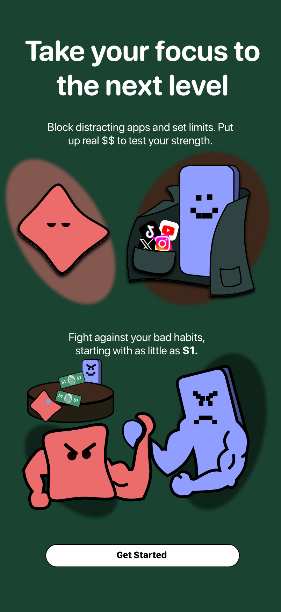
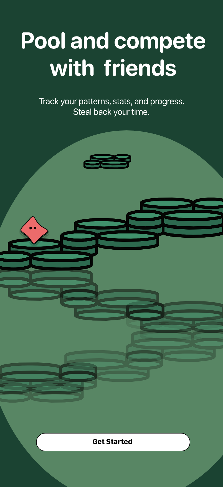

<div align="center">


# Niyah

**Put your money where your mind is.**

Screen-time limits with real stakes. Stick to them and earn more — quit early and lose your stake.

[niyah.live](https://niyah.live) · [Documentation](docs/)

<br />

&nbsp;
&nbsp;


</div>

## How it works

Screen-time apps don't work because there's no real consequence. Niyah is a commitment contract: you stake your own money on your focus.

1. **Deposit** money into your balance
2. **Stake** it on a focus session — distracting apps get blocked via iOS Screen Time
3. **Complete** the session to get your stake back, plus earnings
4. **Quit early** and your stake is gone

**Solo** — stake against your own screen time. Less usage, more earnings.

**Pool** — pool stakes with friends and compete. Lower usage takes a bigger share of the pool.

## Tech stack

- **App** — React Native 0.81 · Expo SDK 54 (New Architecture) · TypeScript strict
- **Navigation** — Expo Router (file-based, typed routes)
- **State** — Zustand
- **Backend** — Firebase Auth · Firestore · Cloud Functions
- **Payments** — Stripe · Plaid
- **Native** — Custom Swift Expo modules (Screen Time / FamilyControls)

## Getting started

Requires Node.js 18+, [pnpm](https://pnpm.io), and Xcode (iOS) or Android Studio (Android).

```bash
pnpm install
cp .env.example .env   # fill in Firebase, Google, and Stripe values
```

You also need the Firebase config files (not in the repo — download from Firebase Console > Project Settings):

- `firebase/GoogleService-Info.plist` (iOS)
- `firebase/google-services.json` (Android)

This project uses `expo-dev-client`, **not** Expo Go — build a dev client once, then everything hot-reloads:

```bash
pnpm build:local       # iOS device via USB   (or: pnpm build:local:sim for Simulator)
pnpm start             # dev server — press 'i' for iOS Simulator, 'a' for Android
```

Android: `npx expo prebuild --platform android --clean && npx expo run:android`

Rebuild only when native code or native dependencies change.

```bash
pnpm test              # run all tests
pnpm ci                # lint + typecheck + test
```

## Documentation

| Doc | Contents |
| --- | --- |
| [Architecture](docs/architecture.md) | Project structure, directory tree |
| [Development](docs/development.md) | Full command reference, env vars, Cloud Functions |
| [Team Setup](docs/team-setup.md) | Teammate onboarding, distribution builds, troubleshooting |
| [Features](docs/features.md) | Auth, sessions, wallet, social, demo mode |
| [Native Modules](docs/native-modules.md) | Firebase, Screen Time, config plugins |
| [Security](docs/security.md) | SSL pinning, key management, Firestore rules |
| [Payments](docs/payments.md) | Stripe, payout formulas, settlement models |
| [Legal](docs/legal.md) | Commitment contract framing, App Store strategy |
| [Roadmap](docs/roadmap.md) | Current status, phases, blockers |

## License

[MIT](LICENSE) © Niyah, Inc.
